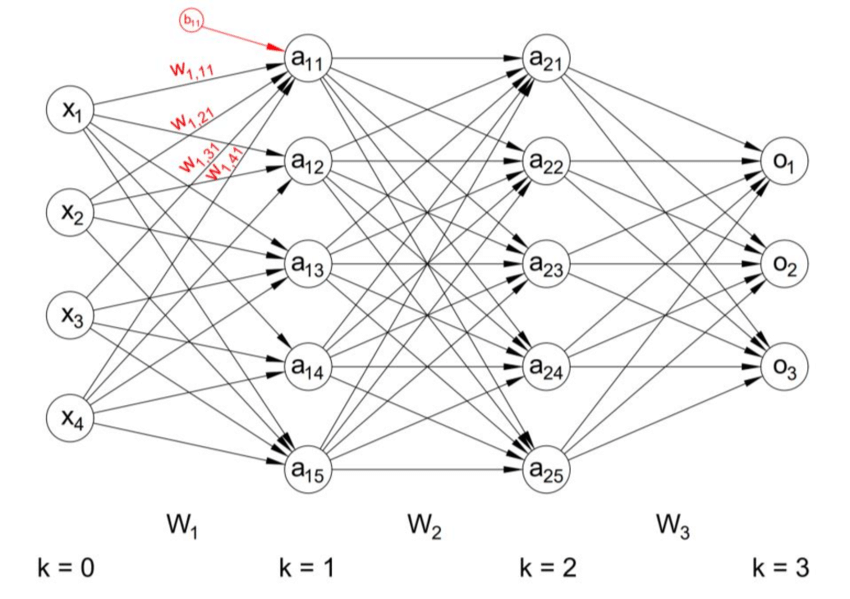
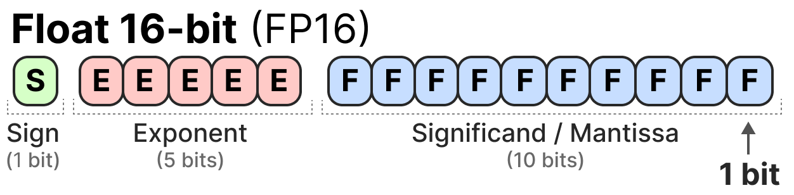
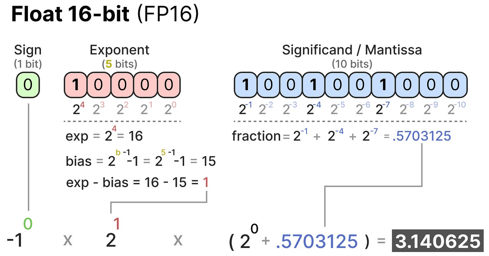
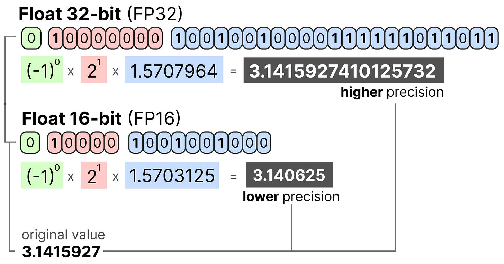

# Quantization - A (very) shallow intro

## Suffixes

[Suffixes](QuantizationSuffixes.md)

## Neural Network

Simplified view of a network showing weights and activation

A more complex view

## What are weights and activations (AI generated descriptions)

Weights are numerical values assigned to the connections between neurons in an LLM. They act like coefficients that indicate the importance of a particular input

Weights control the influence of one neuron's output on the input of another. A higher weight means a stronger signal, while a lower weight indicates a weaker signal

Activations are the values or outputs produced by neurons after they process their inputs through an activation function.

Bias refers to systematic errors or prejudices in the predictions of LLMs, often influenced by the characteristics of the training data.

### Relationship Between Weights and Activations

- Input to Neuron: Input data is fed into a neuron.
- Weighted Sum: The input is multiplied by the connection's weight, and this product is summed up.
- Activation Function: The resulting sum is then passed through an activation function.
- Neuron Output: The output of the activation function is the neuron's "activation," which is then passed to the next layer of the network. 

## What is Quantization

Quantization is reducing model size by using fewer bits per parameter for resource limited devices.

For example if you have an 8Gb GPU, and want to offload training on that GPU, then you're constrained by that 8Gb limit.

This means some models will not run. (Shameless plug.. use a mac, the shared ram model really helps with running larger models)

## Upsides of Quantization

- Reduces model size (so it fits on your gpu, mobile device, rasberry pi, etc)
- Increased inference speed
- Lower energy requirements (dont need a power hungry machine... see the mac studio)
- Nvidia is still king here (performance), but with that, large amounts of VRAM are expensive
- A Mac Studio has less performance, but can run much larger models at a far more cost effective price

## Downsides of Quantization

- Loss of accuracy
- Possible loss of performance
- Errors can accumulate through the neural network

There are some ways to reduce this loss, but thats another presenation...

## Common Quantization Techniques
- PT - Post Training Quantization - used to reduce footprint of a trained model. This is quick, but loss of accuracy is an issue
- QAT - Quantization Aware Training - quantization is simulated during the training process - is better than PT
- DQ - Dynamic Quantization - Weights are quantized before hand, and also during training

## How it is done (a very light intro)

We first calculate a scale factor ( s ) using:

b is the number of bytes that we want to quantize to (8),

α is the _highest absolute value

Then, we use the s to quantize the input x :

Scale factor / Quantization is:

The quantized value now required only 8 bits to represent, so a potential 4Gb of FP32 weights can now be shrunk down to 1Gb of 8 bit ints.

Note, FP4 now seems to be a thing (but I need to read up on it)

## References
Images and material taken from:
https://www.maartengrootendorst.com/blog/quantization/

Models (gguf)
https://huggingface.co/models?sort=trending&search=gguf

[Back to readme](README.md)