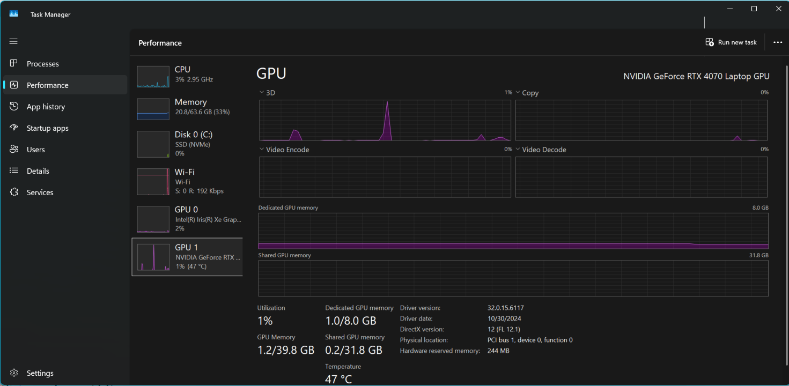

# AI Experiments

### Docker with AI image

``` cmd
docker model pull ai/smollm2
docker model list
# interactive mode
docker model run ai/smollm2
# confirm model runner is active on localhost
curl http://localhost:12434
```

#### GPU Usage


### C# talking to Docker AI Image


### Postgres with pgvector


### RAG Example


### What is Quantization


### References
https://dzone.com/articles/docker-model-runner-dotnet-guide

